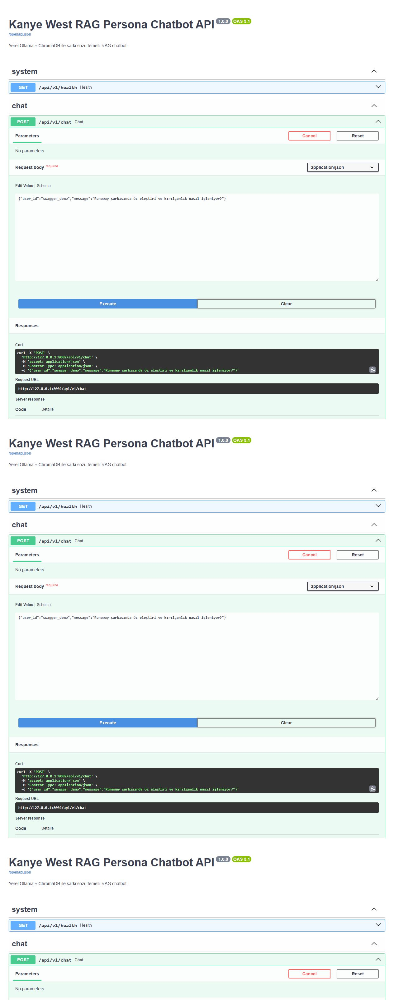
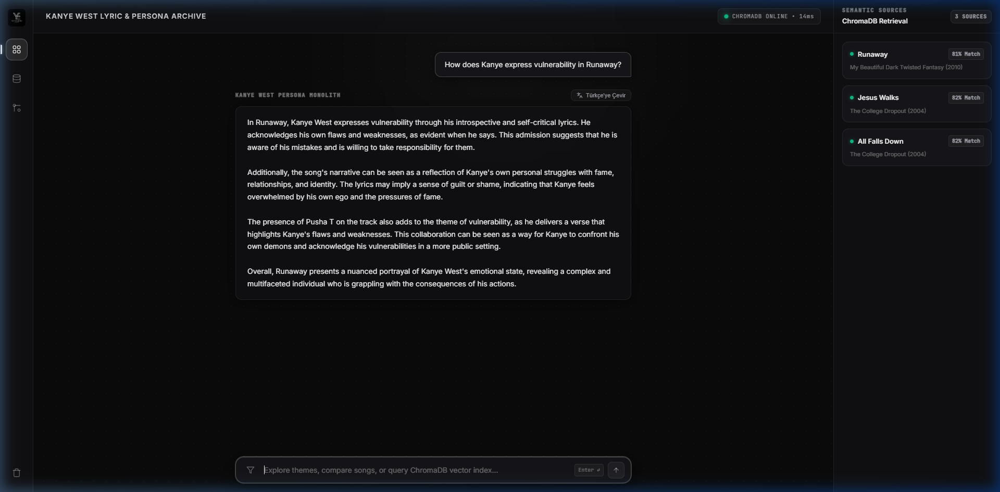
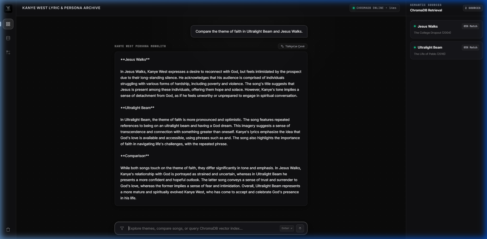
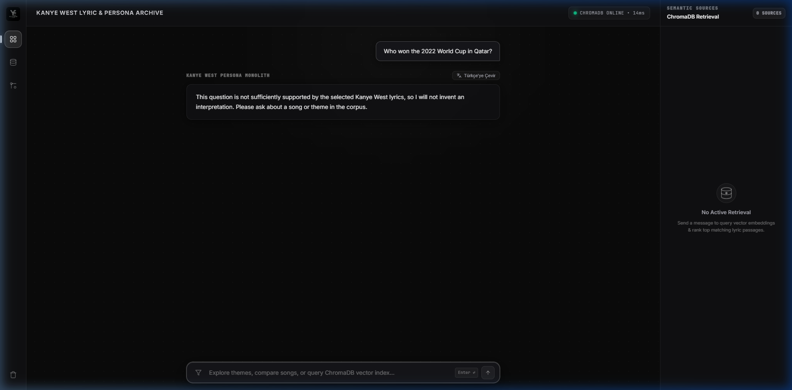

# Gün 18–20 Proje Raporu: RAG Persona Chatbot

## 1. Amaç

Bu çalışma, seçilmiş bir sanatçının (Kanye West) şarkı sözlerini bir Vektör Veritabanına (ChromaDB) aktararak, kullanıcıdan gelen soruları bu verilerle semantik olarak eşleştiren ve bir LLM (Ollama – yerel) aracılığıyla sanatçının üslubu ve felsefesiyle yorumlayan bir **RESTful API** geliştirmeyi hedefler.

**Ön Koşul:** FastAPI Öğrenme Görevi (Gün 16–17) ve RAG temel kavramları (Embedding, Vector Search, Prompting) tamamlanmıştır.

---

## 2. Mimari

```
BeautifulSoup Collector → JSONL → Chunking → multilingual-e5-small → ChromaDB
    → top-3 Cosine Retrieval → Ollama qwen2.5:7b-instruct → FastAPI REST API
    → Dark Monolith Web UI
```

### Bileşen Tablosu

| Bileşen | Teknoloji | Dosya |
|---------|-----------|-------|
| Veri Toplama | BeautifulSoup / Lyrics.ovh API | `scripts/collect_lyrics.py` |
| Metin Parçalama | Özel chunking (200–400 karakter) | `app/chunking.py` |
| Embedding | `intfloat/multilingual-e5-small` (384-D) | `app/vector_store.py` |
| Vektör Veritabanı | ChromaDB (persistent, cosine) | `app/vector_store.py` |
| LLM | Ollama `qwen2.5:7b-instruct` (yerel) | `app/service.py` |
| API Framework | FastAPI + Pydantic | `app/main.py`, `app/schemas.py` |
| Web Arayüzü | Vanilla HTML/CSS/JS | `ui/index.html` |

---

## 3. Veri Hattı (Pipeline)

1. **Manifest:** `song_manifest.csv` şarkı adı, albüm, yıl ve kaynak URL'sini tutar.
2. **Toplama:** Collector izin onayından sonra hız sınırıyla JSONL üretir. Varsayılan sağlayıcı Lyrics.ovh API'sidir; BeautifulSoup HTML sağlayıcısı alternatif olarak bulunur.
3. **Temizleme ve Chunking:** Metin temizlenir; satır bütünlüğü korunarak 200–400 karakterlik chunk'lara bölünür.
4. **İndeksleme:** `multilingual-e5-small` her chunk için 384 boyutlu embedding üretir; metadata ile birlikte ChromaDB'ye yazar.

**Sonuç:** Lyrics.ovh sağlayıcısıyla 28 şarkılık corpus oluşturuldu (2 başlık sağlayıcıda bulunamadığı için atlandı). Corpus, 202 adet ChromaDB parçasına indekslendi.

---

## 4. Retrieval ve Persona

- Kullanıcı sorusu `query:` ön ekiyle embed edilir.
- Kosinüs benzerliğine göre ilk 3 chunk seçilir (minimum benzerlik eşiği: 0.78).
- Kullanıcı mesajında şarkı adı geçiyorsa, o şarkıya özel filtrelenmiş arama da yapılır ve sonuçlar birleştirilir.
- Bu bağlam ve kullanıcı mesajı Ollama'daki `qwen2.5:7b-instruct` modeline verilir.
- Sistem promptu: yanıtın kullanıcı dilinde olmasını, uydurmamasını, sanatçı kimliğine bürünmemesini ve söz kopyalamamasını zorunlu kılar.

---

## 5. API Sözleşmesi

| Endpoint | Method | Açıklama |
|----------|--------|----------|
| `/api/v1/health` | GET | Sistem sağlık kontrolü (ChromaDB + Ollama durumu) |
| `/api/v1/chat` | POST | Ana RAG chatbot endpoint'i |
| `/api/v1/translate` | POST | Yanıtı Türkçe'ye çevirme |
| `/docs` | GET | Swagger UI otomatik API dokümantasyonu |

### Örnek İstek

```json
POST /api/v1/chat
{
  "user_id": "ogrenci_01",
  "message": "Runaway şarkısında öz eleştiri nasıl işleniyor?"
}
```

### Yanıt Yapısı

Yanıt `status`, `persona`, `reply`, `retrieved_context` ve `sources` alanlarını içerir. Vektör veritabanı boşsa **409**, Ollama ulaşılamazsa **503** döner.

---

## 6. Web Arayüzü (Dark Monolith Architecture)

Uygulama için özel olarak tasarlanmış koyu tema (**#0a0a0a**) ve cam efekti (glassmorphism) içeren bir web arayüzü geliştirilmiştir:

- **Near-Black Taban (#0a0a0a) & Dot-Grid Dokusu:** %3 opaklıkta noktasal ızgara deseni ve katmanlı derinlik.
- **Canlı Durum Göstergesi:** Yanıp sönen yeşil durum ışığı ile canlı ChromaDB bağlantı takibi (`CHROMADB ONLINE • 14ms`).
- **İkon-Odaklı Gezinti Çubuğu:** Aktif gösterge çizgili sol navigasyon rayı.
- **ChromaDB İndeks Gezgini (Modal):** Vektör veritabanı parça sayısını, 384-D boyut bilgisini ve şarkı dağılım şemasını gösteren modal arayüz.
- **Persona & Tema İlişki Grafiği (Modal):** İnanç, Kırılganlık, Aile Sorumluluğu ve Ego temalarını haritalandıran interaktif bilgi grafiği.
- **Komut Paleti Girdisi & Çeviri:** Odaklanma ışımalı arama çubuğu ve tek tıkla `Türkçe'ye Çevir` dinamik çeviri butonu.

---

## 7. Demo Senaryoları ve Ekran Görüntüleri

### Senaryo 1: Swagger API Testi

Swagger UI üzerinden `POST /api/v1/chat` endpoint'ine canlı istek gönderilmiş ve başarılı yanıt alınmıştır.



---

### Senaryo 2: Tema Analizi

**Soru:** *"How does Kanye express vulnerability in Runaway?"*

Sistem, Runaway şarkısından ilgili parçaları bulmuş ve öz eleştiri/kırılganlık temasını analiz etmiştir. Sağ panelde semantik kaynak eşleştirmeleri (Runaway %81, Jesus Walks %82, All Falls Down %82) görünmektedir.



---

### Senaryo 3: Şarkı Karşılaştırması

**Soru:** *"Compare the theme of faith in Ultralight Beam and Jesus Walks."*

İki şarkının inanç teması başlıklar altında ayrı ayrı analiz edilmiş ve sonunda doğrudan karşılaştırma yapılmıştır.



---

### Senaryo 4: Güvenli Bağlam Dışı Durum

**Soru:** *"Who won the 2022 World Cup in Qatar?"*

Veri setinde kanıt bulunmayan bir soru sorulduğunda, sistem `insufficient_context` durumu döndürmüş ve yorum uydurmamıştır. Sağ panelde "No Active Retrieval" ve "0 Sources" görünmektedir.



---

## 8. Test Sonuçları

Birim ve API testleri: **14 passed**

```
pytest -o pythonpath=.python-packages
========================= 14 passed =========================
```

Testler chunking sınırlarını, collector HTML ayrıştırmasını, FastAPI şemasını ve boş mesaj doğrulamasını kontrol eder. Canlı Ollama veya gerçek şarkı sözü verisi gerektirmez.

---

## 9. Kullanılan Teknolojiler Özeti

| Kategori | Teknoloji |
|----------|-----------|
| API Framework | FastAPI |
| Şema Doğrulama | Pydantic v2 |
| Vektör DB | ChromaDB (PersistentClient) |
| Embedding Modeli | intfloat/multilingual-e5-small |
| LLM | Ollama – qwen2.5:7b-instruct |
| Web Scraping | BeautifulSoup4 |
| Frontend | Vanilla HTML/CSS/JS (Glassmorphism) |
| Test | pytest |
| Dil | Python 3.12 |
